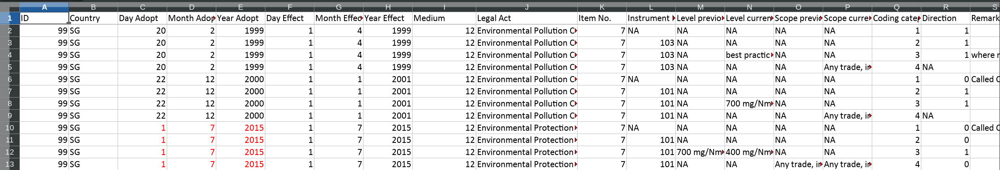

```{r echo=FALSE, message=FALSE, warning=FALSE}
library(PolicyPortfolios)
```

\marginnote{This document refers to `PolicyPortfolios` version `r packageVersion("PolicyPortfolios")`.}


# Why PolicyPortfolios?

A policy portfolio is a collection of simple assessments of the presence or
absense of state intervention in a specific area (Target) using a concrete state
capacity (Instrument). How specific or general the area is, is up to the
researcher. How broad or restricted is the collection of assessments is also up
to the researcher [@adam:2017:rulegrowth].
Using policy portfolios as objects of analysis allows political science to standardize
comparitive policy analysis by providing a common ground of policy intervention,
and represents a first step of comparing state intervention in different fields
of public life.


The package has two sorts of families of functions to deal with policy portfolios.
One set is intended to facilitate the management of portfolio data, either
coming from external sources or once it has been treated in `R`.
The second set of functions is intended to facilitate the analysis and
visualization of policy portfolio data.

This document requires the following packages:
```{r, message = FALSE, warning = FALSE}
library(dplyr)
library(tidyr)
library(ggplot2)
```


# Input Data

## Structure and characteristics

The input data required for the package to work with is a tidy dataset
[@wickham:2014:tidy], where every observation is a row and every variable is
a column. This makes the data easy to manipulate, model and visualize.

Two fake datasets to show the possibilities of the package have been created, and they can be accessed using the `data(P.education)` and `data(P.energy)` calls.

There are two portfolios, one in the energy sector (`P.energy`) and one in the education sector (`P.education`).
The energy one looks like follows:

```{r, message = FALSE, warning = FALSE}
library(PolicyPortfolios)
data(P.energy)
P.energy
```

The object `P.energy` is a tidy data frame (a tibble) that contains 12,375 rows and 6
variables. 5 of the variables are markers of the case, and only one ("covered")
is in fact actual data. It indicates whether in the corresponding observation
(defined by "Country", "Sector", "Year", "Instrument" and "Target") there is
policy intervention (1) or not (0).


In this case, the `P.energy` dataset contains several countries and traces them
over several years:
```{r}
levels(P.energy$Country)
unique(P.energy$Year)
```

The portfolio is in fact the combination of a two-dimensional space composed by
policy Targets ("Target") and the policy Instruments ("Instruments") than can be used to address
such targets.
```{r}
levels(P.energy$Target)
levels(P.energy$Instrument)
```

The variable "Sector" is only introduced to be able to compare policy sectors.
Only policy sectors with the same combinations of Instruments and Targets can be
in the same dataset. Otherwise it is understood that the total combination of
Targets and Instruments is the one that defines the portfolio. Therefore, is
preferable to work with separated portfolios when the space defined by Targets
and Instruments is different. For instance, in the portfolio of the education
sector, the countries and years are equal as in the energy, but the targets and
instruments differ:
```{r}
data(P.education)
levels(P.education$Target)
levels(P.education$Instrument)
```

## Prepare a dataset with a portfolio structure

The function `pp_clean()` may help in transforming the data from a
spreadsheet-like format into a tidy format.

By default, it uses a structure coming from the
[consensus](https://publicpolicy-knill.org/?post-type=research&post_id=122) research
project. [Guidelines](https://www.gsi.uni-muenchen.de/lehreinheiten/ls_emp_theo/forschung/dokumente/guidelinesconsensus.pdf) for external experts to collect data on
social and environmental policies are available, as well as the [coding
manual](https://www.gsi.uni-muenchen.de/lehreinheiten/ls_emp_theo/forschung/dokumente/codingmanual.pdf).
An example of a speardsheet collecting data for policy portfolios in the
Consensus project is the following:
{width=800px}.


```{r eval = FALSE, echo = TRUE}
spreadsheet <- read.table(...)
d <- pp_clean(spreadsheet,
              Sector = "Environmental",
              Year.name = "Year.Adopt",
              coding.category.name = "Coding.category",
              Instrument.name = "Instrument.No.",
              Target.name = "Item.No.")

pp_complete()
```

`pp_clean()` easily transforms a wide format coming from a spreadsheet into a
tidy object suitable for policy portfolio analysis, doing several checks on the
consistency of the original data and helping to spot inconsistencies and to debug
problems with the coding process.

The coding process involves looking for instances where there is policy
intervention in different scenarios, and therefore in cases (Instruments and
Targets) when even not a single case of policy intervention has been observed
the data would not include such a space. For instance, we may be interested in
recording whether there is policy intervention in, say, providing funds for
schools when there is a disabled student in a clasroom. But if we do not observe
any single case in the portfolio, the final dataset will not contain this
possibility, and therefore we must _complete_ the observed portfolio with the
potential full range of Targets and instruments. THis is  achieved with the `pp_complete()` function.

```{r eval = FALSE, echo = TRUE}
dc <- pp_complete(d,
                  Instrument.set = full.factor.of.potential.instruments,
                  Target.set = full.factor.of.potential.targets)
```

One the dataset is cleaned and complete we may proceed to its analysis.


# Analyze policy portfolios

One the structure of the tidy dataset required is clear, we can start using the
functions to extract information of interest from it.


## Summarize portfolios
The main function that summarizes the characteristics of the portfolio is
`pp_measures()`. It takes a tidy portfolio data frame as input and produces a tidy data frame with entries for all the Countries and Years of the original input plus several measures with their corresponding values.
```{r echo = TRUE, eval = FALSE}
pp_measures(P.energy)
```
```{r echo = FALSE, eval = TRUE, size = 'footnotesize'}
knitr::kable(pp_measures(P.energy) %>% slice(1:15))
```

The argument `id` allows to explicitly ask for concrete portfolios, defined by
the elements of the list that is passed.
```{r}
pp_measures(P.energy, id = list(Country = "Borduria", Year = 2010:2021))
```


As a tidy dataset itself, the output of `pp_measures()` can be easily combined
with other functions to produce figures or tables of interest:
```{r, fig.width = 8, fig.height = 4, fig.cap = 'Temporal evolution of the size of portfolios, by country.'}
pp_measures(P.energy) %>%
  # Use only a single measure of interest
  filter(Measure == "Size") %>%
  # Use only observations with a concrete time period
  filter(Year > 2022) %>%
  # Convert the long format into wide, and therefore "Size" becomes a column
  spread(Measure, value) %>%
  # Pass this object to "ggplot()" and produce a time series of portfolio "Size"
  ggplot(aes(x = Year, y = Size, color = Country)) +
    geom_line()
```
In this sense, the output produced by the functions in the package is directly suitable for being used by `ggplot2`, based on the grammar of graphics [@wilkinson:2005:grammar], which empowers `R` users by allowing them to flexibly crate graphics [@wickham:2009:ggplot2].


```{r}
pp_measures(P.energy) %>%
  # Pick the two measures of portfolio diversity
  filter(Measure %in% c("Div.gs", "Div.sh")) %>%
  # Use only the last year observation
  filter(Year == max(Year)) %>%
  # Select only the relevant variables required to produce the output table
  select(Country, Measure.label, value) %>%
  # Transform the long object into wide, so that every Measure is one column
  spread(Measure.label, value) %>%
  # Sort by decreasing Shannon diversity
  arrange(desc(`Diversity (Shannon)`))
```

The current list of Measures that `pp_measures()` produces is the following:
```{r echo = FALSE, eval = TRUE}
pp_measures(P.energy) %>%
  select(Measure, Measure.label) %>%
  unique() %>%
  knitr::kable()
```


## Visual display of portfolios

The function `pp_plot()` produces a visual representation of the two-dimensional
space of policy Targets (horizontal axis) and Instruments (vertical axis) and
whether such space is covered by policy intervention or not.

It requires a single policy portfolio, and therefore if the original tidy
dataset includes several years or countries, this must be explicitly stated
using the argument `id`:
```{r fig.width = 10, fig.height = 4, fig.cap = 'Visual representation of the Energy portfolio of Borduria in 2025, using the pp_plot() function and defining a specific country and year in a list in the id argument.'}
pp_plot(P.energy, id = list(Country = "Borduria", Year = 2025))
```

By default `pp_plot()` produces a caption with the source of the data, a
subtitle with the measures of the portfolio and the boxes are side by side, but
all these features can be tunned in the arguments. Check the documentation for
more details.


Several options can be passed to tune the visual aspect of the portfolio,
namely `spacing`, that includes separation between the boxes, dropping the
subtitle with `subtitle` and changing the default caption with `caption`.
```{r fig.width = 6, fig.height = 3, fig.cap = 'Visual representation of the Energy portfolio of Borduria in 2025, using the pp_plot() function and defining a specific country and year in a list in the id argument.'}
pp_plot(P.education, 
        id = list(Country = "Borduria", Year = 2030),
        spacing = TRUE,
        subtitle = FALSE, caption = NULL)
```


Finally, `pp_report()` is an encompassing function that generates a report in
html with detailed descritive analysis of the portfolios, both considering them
individually as well as comparatively (comparing countries or measures).
```{r eval = FALSE, echo = TRUE}
pp_report(P.energy)
```

It also contains several arguments that can help in the analysis, but the
defaults are expected to be comprehensive and meaningful.


# Other possibilities

It is possible to transform the tidy policy portfolio data frame into an array,
in case that operations in a matrix-like style are required to be performed.
This can be achieved with the `pp_array()` function:
```{r}
A <- pp_array(P.energy)

# Get the dimensions:
# 3 is Country
# 1 is Sector
# 11 is Year
# 15 is Instrument
# 25 is Target
dim(A)
```

# Final remarks
`PolicyPortfolios` facilitates the generation of measures of policy portfolios
and its visualization, as well as the cleaning process of such datasets. It only
requires, as a central component, a tidy dataset that defines whether certain
policy space defined by a Target and an Instrument is covered by policy
intervention or not.


# Development
The development of `PolicyPortfolios` (track changes, propose improvements, report bugs) can be followed at [github](https://github.com/xfim/PolicyPortfolios/).


<!--
# Acknowledgements
I would like to thank code contributions and ideas from [Zachary M. Jones][zachary], [Julien Cornebise][julien], [Max Joseph][maxjoseph], and ideas from [Dieter Menne][dieter], Bill Dixon, [Christopher Gandrud][gandrud], Barret Schloerke and GitHub users knokknok, akrawitz, Justina (Juste), stefanherzog, [Brain Stock][brianstock] and [Jonas Kristoffer Lindeløv][lindeloev].
-->

# References

<!-- Links -->

